# Set up EC2 and configure Python environment

This is a step-by-step tutorial of how to set up a Python environment for EC2 server.

## 1. Sign In
You can either access through root user or through IAM role. For users just signed up, we can only login through as root user by clicking "Sign in using root user email" below:

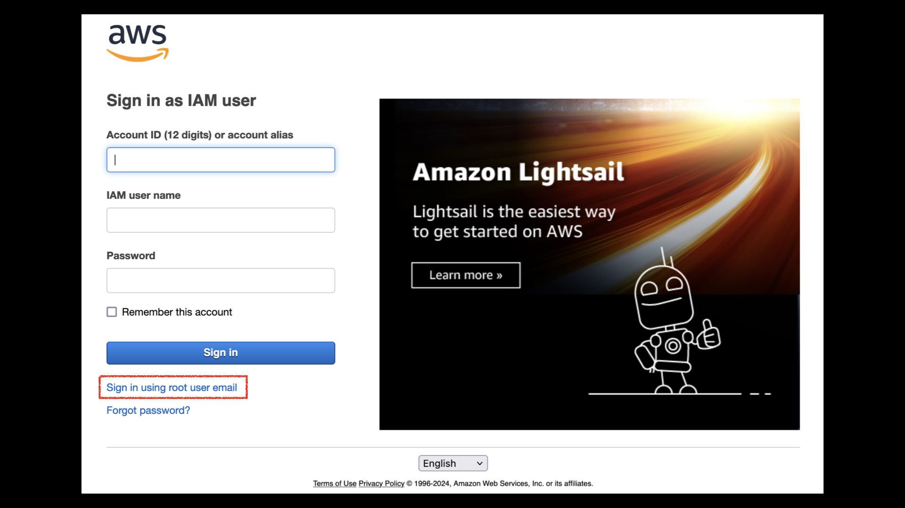

Choose "Root user", enter email and hit next.

Finally, hit "Sign in".

## 2. Create first AWS EC2 instance

After signed in, choose "Service", then click "All services"

Select "EC2" to enter EC2 dashboard.

Before launching an instance, you need to make sure the service location is correct. Here, I choose "Singapore" as the server's location. You need to make sure the server is close to you or your customers. After that, you can click "Launch instance" to start configuring an server instance.

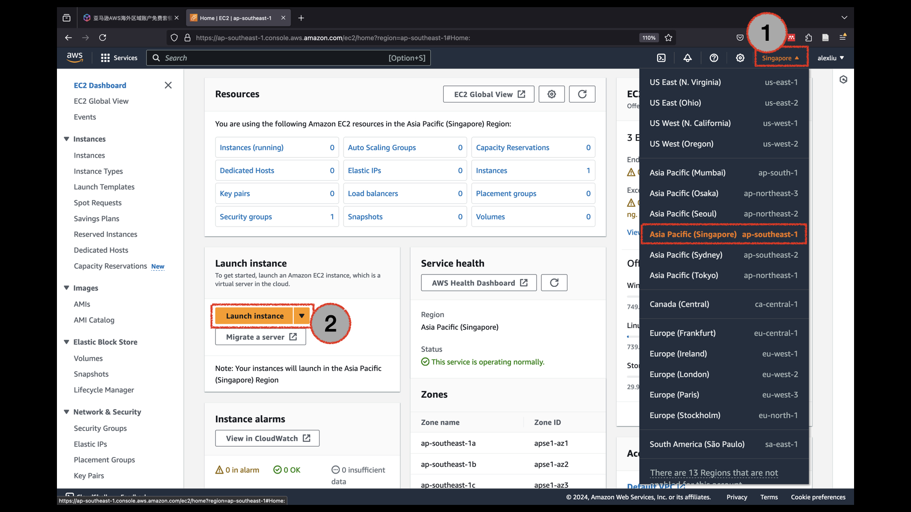

Here, I named the instance as "my_linux_server". Then, I choose the operating system, and here I used Ubuntu (linux server).

To be specific, as a starter, you can select the version of "Ubuntu Server 24.04 LTS (HVM)". Moreover, the architecture is "64-bit (x86)". For free-tier The instance type should be "t2.micro".

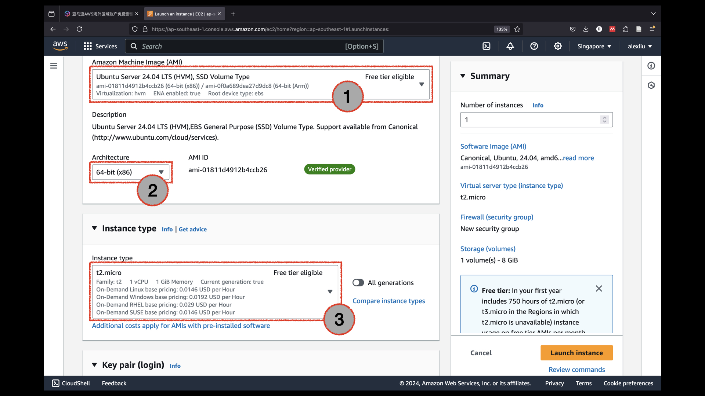

Since we need to remote connect to the machine, we need to create a key pair to establish secure connection by clicking on the "create new key pair" button.

The key pair generates a public key and a private key. You need to give the key pair a name. For example, here I choose "aws_linux_server". I choose the RDS algorithm for encryption. Since I am a Mac user, I choose the key file format as ".pem". For Windows user, ".ppk" format is preferred. After all the configuration, click "Create key pair", and the browser will download your private key to your machine.

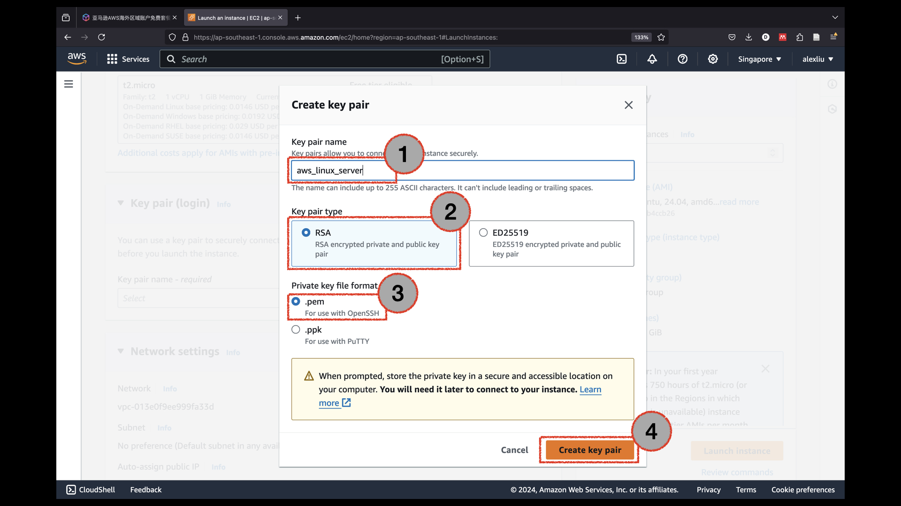

We need to set up the network settings. We need to allow ssh traffic. Furthermore, since we may establish a server or an application, we would just allow HTTP/HTTPS traffic from the internet.

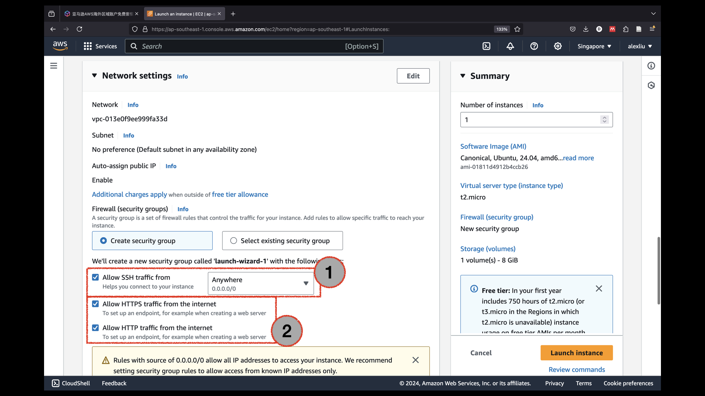

Finally, we need to set up the storage to 30 GBs as shown below. This is the maximum allowed storage of the free-tier. Finally, there is a summary on the right hand side of the website. After making sure that everything is correct, click "Launch instance".

It won't take more than several minutes for AWS to get everything ready. 

As mentioned, you can always find any service by clicking "Services" button on upper left. This time, we can find EC2 service by clicking "Recently visited" and then click "EC2". 

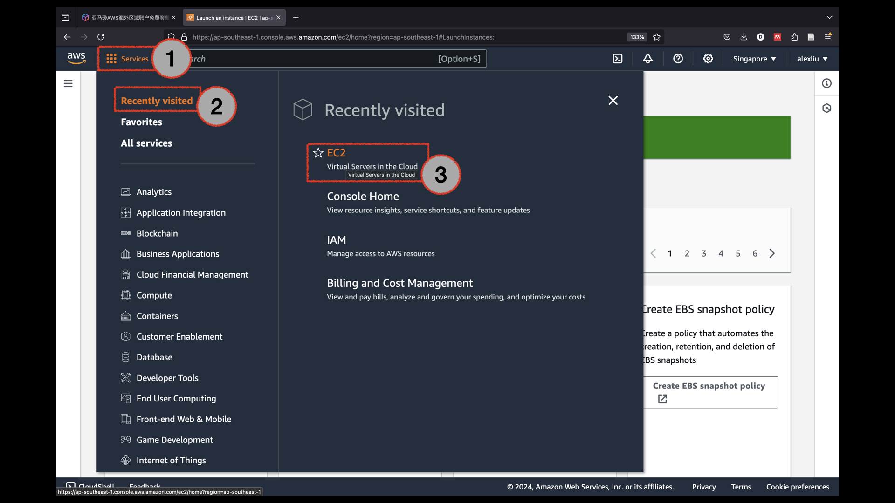

After clicking "EC2", we arrived at a status dashboard of the EC2 service. On the right hand side shows your remaining time for free tier services. We can click on the "Instances (running)" to check our running services.

We arrive at a page listing all running EC2 instances. We can click on the specific Instance ID to look at information about the corresponding instance.

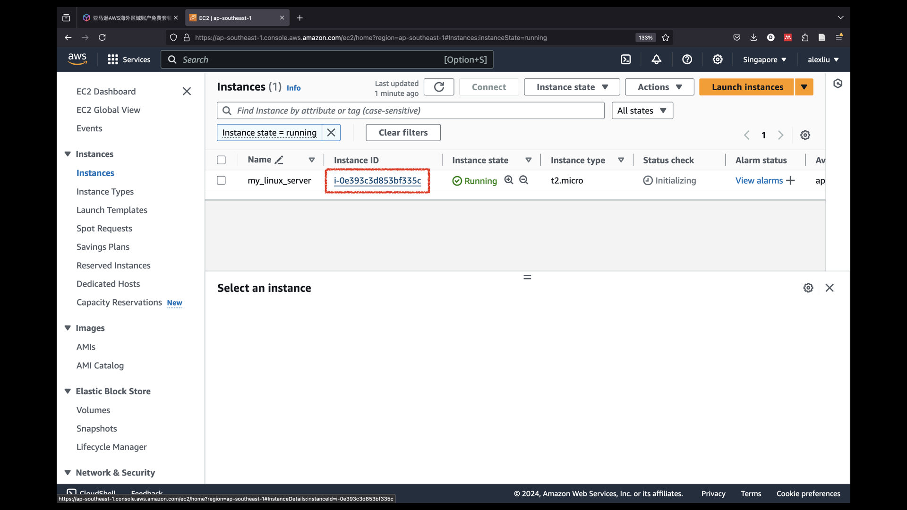

After we launch the page for the instance, let's click "Connect" button since we want to connect to the machine.

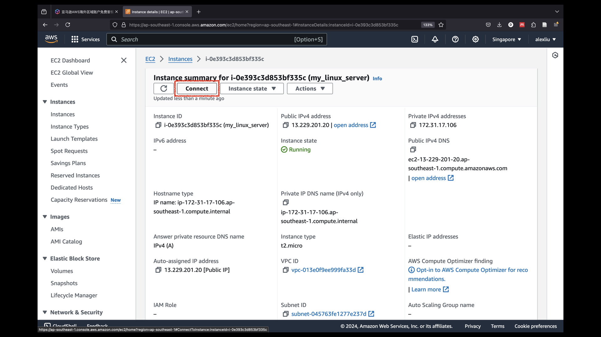

There are different ways to connect the EC2 instance. One easy way is to connect within the browser by selecting "EC2 Instance Connect" and then click on "Connect".

A new tab is established with the black terminal screen as shown below. The upper part summarizes the status of the machine, whereas the lower part allow one to text commands into the server.

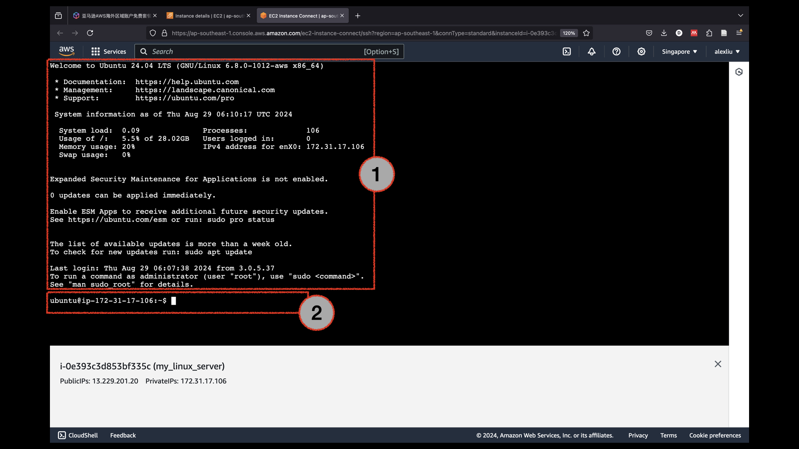

A more professional way to connect is to use "SSH client" by clicking that option. Then, we can see a step-by-step guide of the establishing an SSH connection.

On your local machine, you can turn on your preferred command line tool like the Terminal in Mac or the Powershell in Win. Following the tutorial from the last image, we first run the "chmod 400" command to change to permission level for security reason. Then, we run the "ssh" command to establish the connection. If asked about wether to continue, type "yes" in the command line and hit enter to continue.

And now we just established a connection to the instance.

You can just type Linux commands you know. For example, "pwd" for passwords. "exit" to log out and end the connection.

## 3. Set up Python environment

Let's login again using ssh command to set up the remote server. First, we just update the related packages using the command "sudo apt update" and "sudo apt-get update".

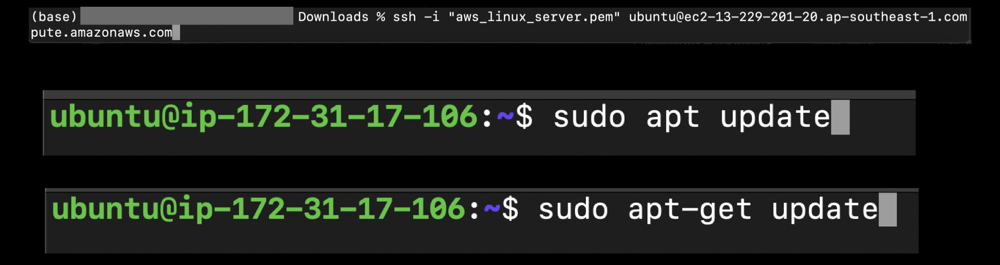

Then, we install the latest python version from "apt-get" using the following command. Choose "Y" to continue.

Type "python3" to enter python page. We can now see that the python version is updated.

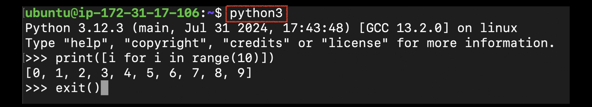

Run the command `python3 -m venv venv` to run the "venv" module to create a new environment called "venv" in a new folder called "venv". The environment is "virtual", meaning that we can activate it or deactivate it, and all the code in within the "venv" folder.

## 4. Set up Jupyter-lab server for remote access

We can use `source venv/bin/activate` to activate the virtual Python environment we just created. After that, we want to install jupyter-lab within the environment using `pip install jupyterlab`. We try to establish a Jupyter-lab server for our development.

Enter the command `jupyter-lab passwd` to create a password. This is necessary because only you should have access to the Jupyter-lab. Then we can start running the server using the command `jupyter-lab --ip='*' --port=8080 --no-browser`. After that, we can see that the server is running and we can just close this terminal.

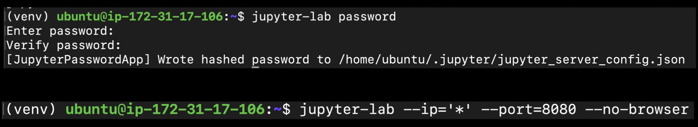

Finally, we need to settle the network configuration to expose the portal of 8080 to the network. At the instance page, scroll down the select "Security", and then click on the "Security groups" to set up the "firewall" in AWS.

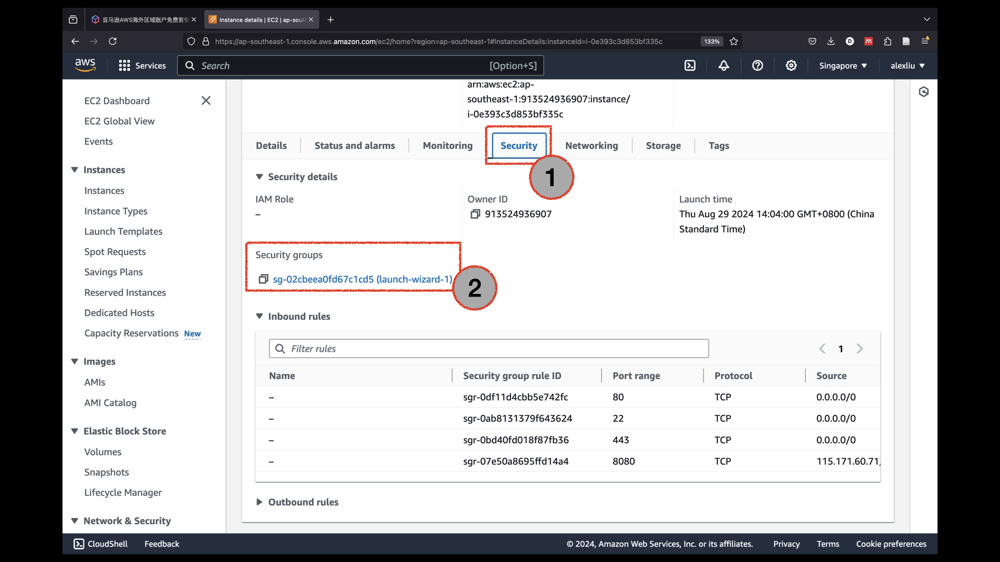

Click on "Edit inbound rules".

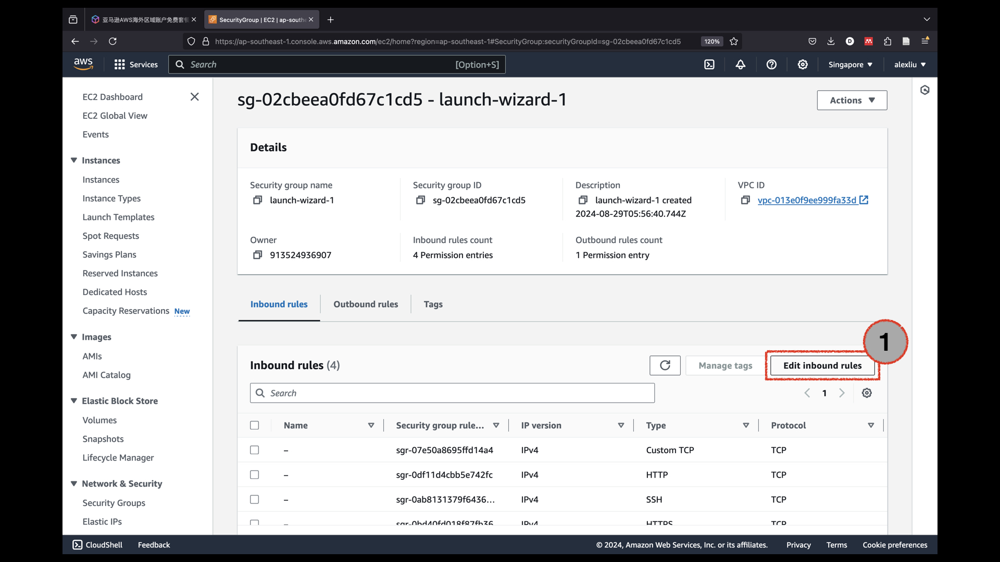

Add a new rule by clicking "Add rule" on bottom left. Then, set up the type as "Custom TCP". Set the port range to 8080. You can set up the source to any. Otherwise, you can use your own IP address if you don't change IP address frequently. After all settings, click "Save rules" to save results.

We can find the public IPv4 address from the instance page to access it.

For example, here that IP address is `13.229.201.20`. Thus, we can visit Jupyter-lab using the command `13.229.201.20:8080/lab`. After entering the password, you can see that we sucessfully "entered" the remote machine using Jupyter-lab.
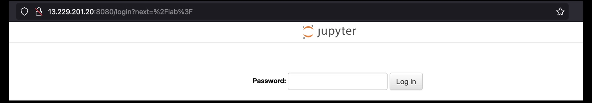

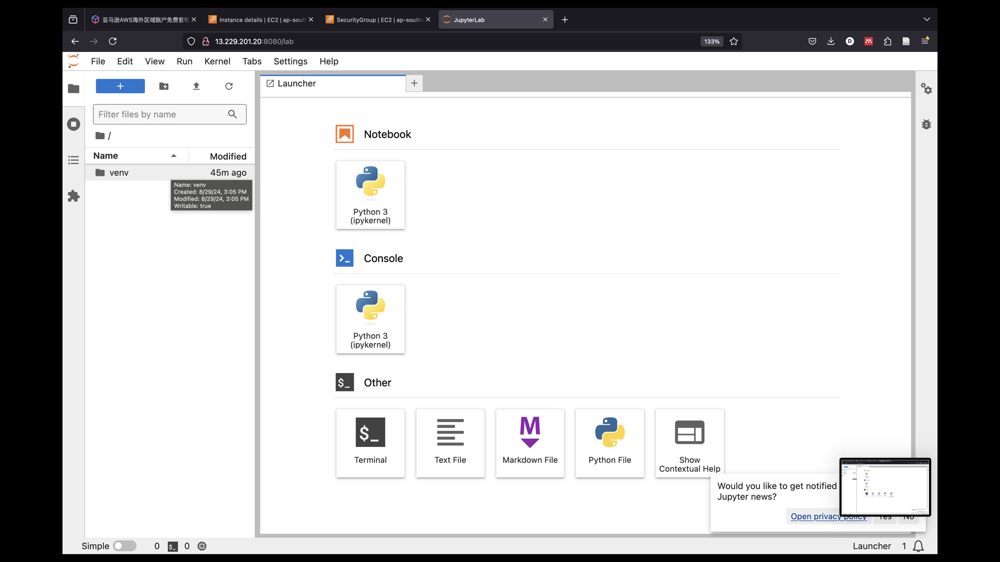

It is also easy to stop the server. After SSH into the remote EC2, we can enter `jupyter-lab list` to see all running servers. we can run `jupyter-lab stop` to stop the server.

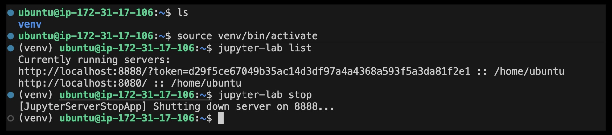

## 5. Use Visio Studio Code to SSH the EC2 server

Another way of using Python in remote machine is by connecting using the VS Code editor by installing the extention called "Remote - SSH". You need to enable this extention.

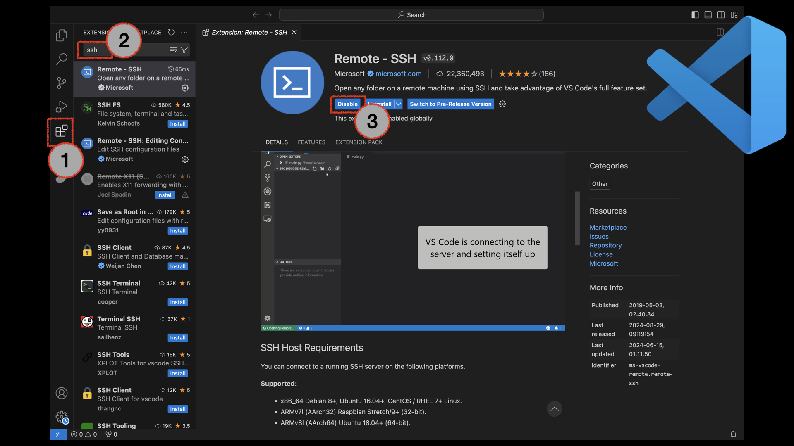

You can click on the bottom left blue bottom. After that, you can see a command pallate. Click on "Connect to Host...".

Then, click on "Add New SSH Host...". Here you can just type in the ssh command (recall that you can find that command from the AWS website).

In the command pallate, click on "Configure SSH Hosts..." to further configure the information.

A file in the path `.ssh/config` is opened. In the terminal, I used the command `cp aws_linux_server.pem ~/.ssh` to copy the file to the ".ssh" folder. I also changed the "IdentifyFile" filed to the new directory of the key file.

After that we can click this command instead of entering ssh command everytime.

Notice that after a connection is built, the blue part on the lower left changed.

If we open terminal, we can see that the terminal is also ssh connected.

## Close and manage instance

Let's close our instance to avoid unexpected fees for now. Click on "Instances (running)" to view all running instances. 

We can click on instance state to stop instance, reboot instance, and terminate (delete) instance.

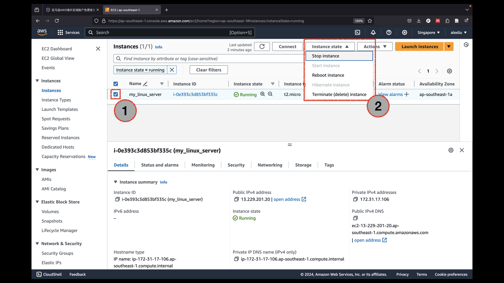

Another thing is to generate an alert message if costs are generated. We can do this by clicking on the user name, and then on "Billing and Cost Management". 
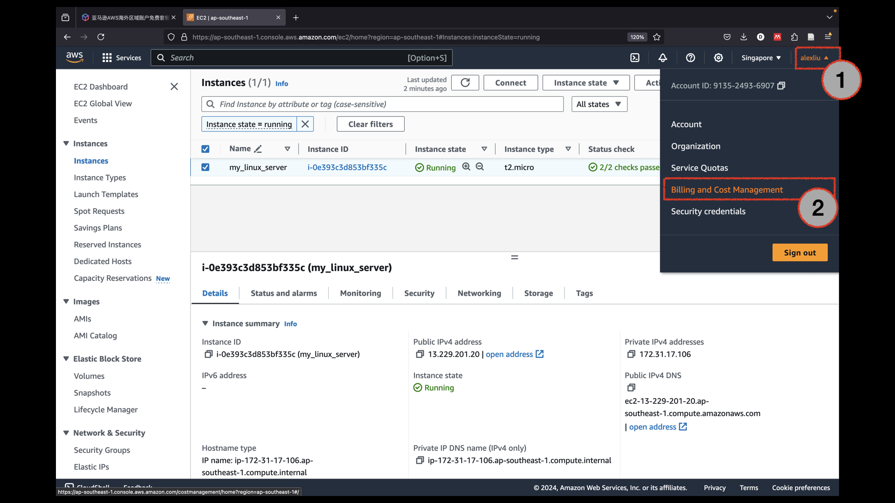

Find Budgets on the left, then click on "Create Budget" to create an usage alert. There are some default templates to help you create such alerts.

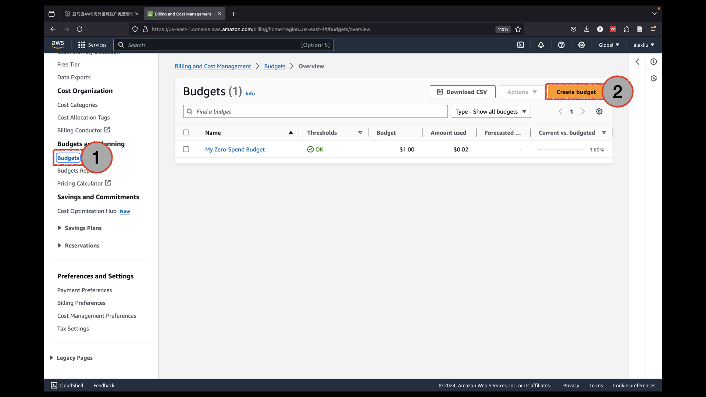

