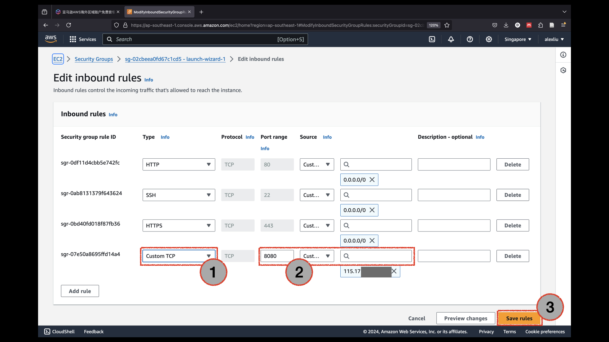

注：本中文教程使用AI直接翻译自英文教程。

# 设置EC2并配置Python环境

这是一个如何为EC2服务器设置Python环境的分步教程。

## 1. 登录
您可以通过根用户或IAM角色访问。对于刚注册的用户，我们只能通过点击下面的"使用根用户电子邮件登录"作为根用户登录：

选择"根用户"，输入电子邮件并点击下一步。

最后，点击"登录"。

## 2. 创建第一个AWS EC2实例

登录后，选择"服务"，然后点击"所有服务"

选择"EC2"进入EC2仪表板。

在启动实例之前，您需要确保服务位置正确。这里，我选择"新加坡"作为服务器的位置。您需要确保服务器靠近您或您的客户。之后，您可以点击"启动实例"开始配置服务器实例。

在这里，我将实例命名为"my_linux_server"。然后，我选择操作系统，这里我使用Ubuntu（linux服务器）。

具体来说，作为初学者，您可以选择"Ubuntu Server 24.04 LTS (HVM)"版本。此外，架构为"64位（x86）"。对于免费层，实例类型应该是"t2.micro"。

由于我们需要远程连接到机器，我们需要创建一个密钥对以建立安全连接，点击"创建新密钥对"按钮。

密钥对生成一个公钥和一个私钥。您需要给密钥对一个名称。例如，这里我选择"aws_linux_server"。我选择RDS算法进行加密。由于我是Mac用户，我选择".pem"作为密钥文件格式。对于Windows用户，推荐使用".ppk"格式。完成所有配置后，点击"创建密钥对"，浏览器将下载您的私钥到您的机器。

我们需要设置网络设置。我们需要允许ssh流量。此外，由于我们可能会建立一个服务器或应用程序，我们就允许来自互联网的HTTP/HTTPS流量。

最后，我们需要将存储设置为30 GB，如下所示。这是免费层允许的最大存储容量。最后，网站右侧有一个摘要。确保一切正确后，点击"启动实例"。

AWS不会花超过几分钟就能准备好一切。

如前所述，您可以通过点击左上角的"服务"按钮找到任何服务。这次，我们可以通过点击"最近访问"然后点击"EC2"找到EC2服务。

点击"EC2"后，我们到达了EC2服务的状态仪表板。右侧显示您剩余的免费层服务时间。我们可以点击"实例（正在运行）"来查看我们正在运行的服务。

我们到达一个列出所有正在运行的EC2实例的页面。我们可以点击特定的实例ID来查看有关相应实例的信息。

启动实例页面后，让我们点击"连接"按钮，因为我们想连接到机器。

有不同的方法可以连接EC2实例。一种简单的方法是通过选择"EC2实例连接"然后点击"连接"在浏览器内连接。

一个新的标签页建立，显示黑色终端屏幕，如下所示。上部总结了机器的状态，而下部允许人们向服务器输入文本命令。

一种更专业的连接方式是使用"SSH客户端"，点击该选项。然后，我们可以看到建立SSH连接的分步指南。

在您的本地机器上，您可以打开您喜欢的命令行工具，如Mac中的Terminal或Win中的Powershell。按照上一张图片的教程，我们首先运行"chmod 400"命令以出于安全原因更改权限级别。然后，我们运行"ssh"命令建立连接。如果被问到是否继续，在命令行中输入"yes"并按回车继续。

现在我们刚刚建立了与实例的连接。

您可以输入您知道的Linux命令。例如，"pwd"查看当前目录。"exit"退出并结束连接。

## 3. 设置Python环境

让我们再次使用ssh命令登录以设置远程服务器。首先，我们使用命令"sudo apt update"和"sudo apt-get update"更新相关软件包。

然后，我们使用以下命令从"apt-get"安装最新的python版本。选择"Y"继续。

输入"python3"进入python页面。我们现在可以看到python版本已更新。

运行命令`python3 -m venv venv`来运行"venv"模块，在名为"venv"的新文件夹中创建一个名为"venv"的新环境。这个环境是"虚拟的"，意味着我们可以激活或停用它，所有代码都在"venv"文件夹内。

## 4. 设置Jupyter-lab服务器以进行远程访问

我们可以使用`source venv/bin/activate`来激活我们刚刚创建的虚拟Python环境。之后，我们希望使用`pip install jupyterlab`在环境中安装jupyter-lab。我们尝试为我们的开发建立一个Jupyter-lab服务器。

输入命令`jupyter-lab passwd`来创建密码。这是必要的，因为只有您应该有权访问Jupyter-lab。然后我们可以使用命令`jupyter-lab --ip='*' --port=8080 --no-browser`开始运行服务器。之后，我们可以看到服务器正在运行，我们可以关闭这个终端。

最后，我们需要解决网络配置，将8080端口暴露给网络。在实例页面，向下滚动选择"安全性"，然后点击"安全组"来设置AWS中的"防火墙"。

点击"编辑入站规则"。

通过点击左下角的"添加规则"来添加新规则。然后，将类型设置为"自定义TCP"。将端口范围设置为8080。您可以将源设置为任何位置。否则，如果您的IP地址不经常变化，可以使用自己的IP地址。完成所有设置后，点击"保存规则"保存结果。

我们可以从实例页面找到公共IPv4地址来访问它。

例如，这里的IP地址是`13.229.201.20`。因此，我们可以使用命令`13.229.201.20:8080/lab`访问Jupyter-lab。输入密码后，您可以看到我们成功地使用Jupyter-lab"进入"了远程机器。

停止服务器也很容易。通过SSH进入远程EC2后，我们可以输入`jupyter-lab list`来查看所有正在运行的服务器。我们可以运行`jupyter-lab stop`来停止服务器。

## 5. 使用Visual Studio Code通过SSH连接EC2服务器

在远程机器上使用Python的另一种方法是通过安装名为"Remote - SSH"的扩展来使用VS Code编辑器连接。您需要启用这个扩展。

您可以点击左下角的蓝色按钮。之后，您可以看到一个命令面板。点击"连接到主机..."。

然后，点击"添加新的SSH主机..."。在这里，您只需输入ssh命令（回想一下，您可以在AWS网站上找到该命令）。

在命令面板中，点击"配置SSH主机..."以进一步配置信息。

打开了路径`.ssh/config`中的文件。在终端中，我使用命令`cp aws_linux_server.pem ~/.ssh`将文件复制到".ssh"文件夹。我还将"IdentifyFile"字段更改为密钥文件的新目录。

之后，我们可以点击这个命令，而不是每次都输入ssh命令。

注意，建立连接后，左下角的蓝色部分发生了变化。

如果我们打开终端，我们可以看到终端也是通过ssh连接的。

## 关闭和管理实例

让我们暂时关闭我们的实例，以避免意外费用。点击"实例（正在运行）"查看所有正在运行的实例。

我们可以点击实例状态来停止实例、重启实例和终止（删除）实例。

另一件事是在产生成本时生成警报消息。我们可以通过点击用户名，然后点击"账单和成本管理"来做到这一点。

在左侧找到预算，然后点击"创建预算"来创建使用警报。有一些默认模板可以帮助您创建此类警报。

